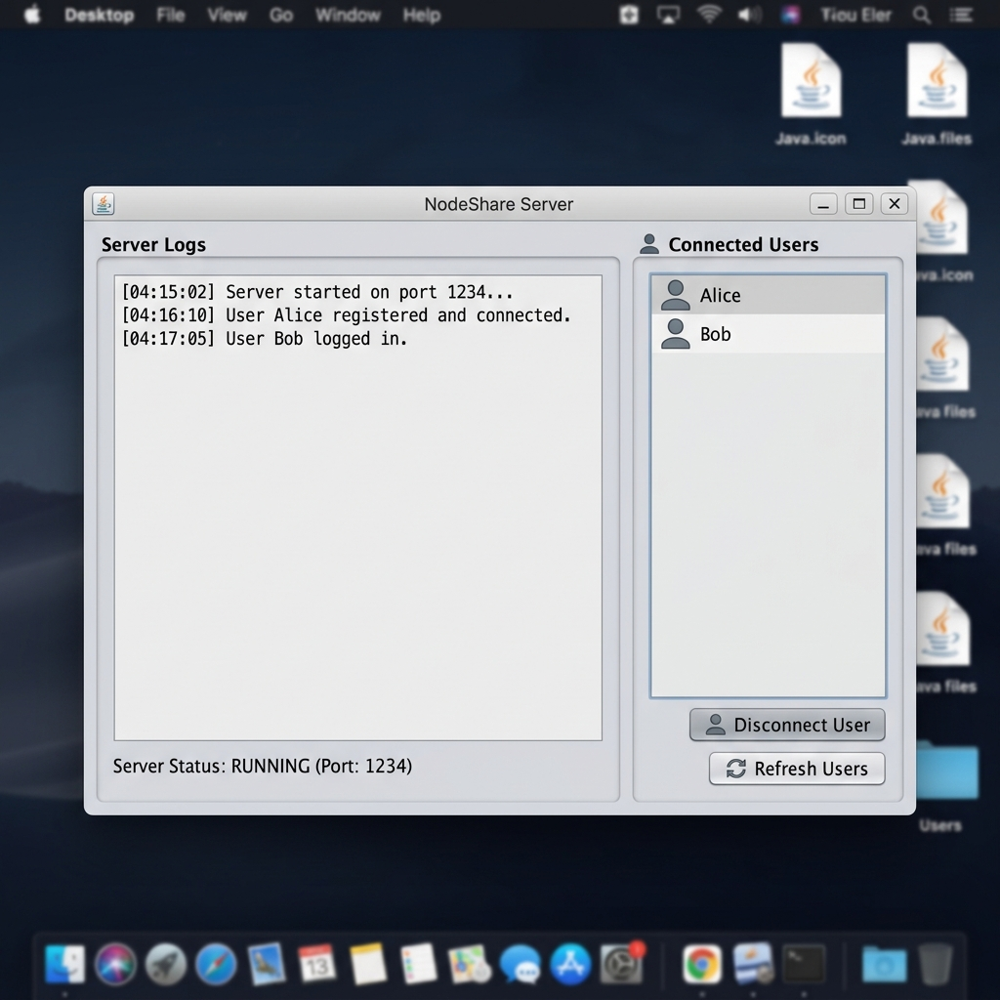
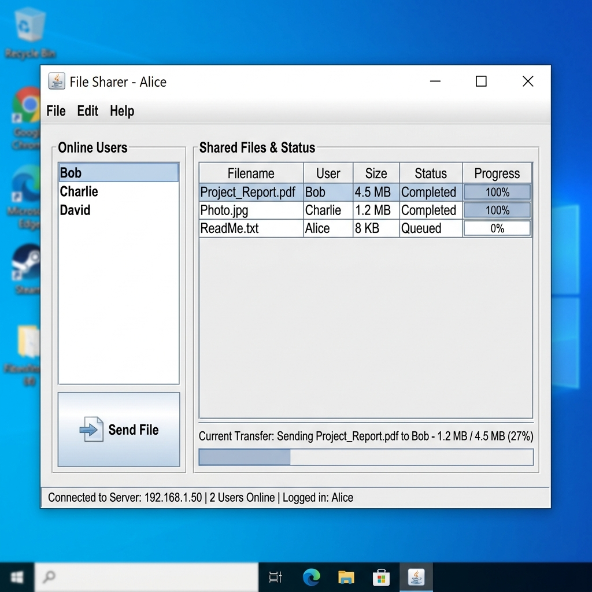

# NodeShare

NodeShare is a lightweight, Java-based client-server file-sharing application. It features a graphical user interface (GUI) built with Java Swing and facilitates real-time, authenticated file transfers between multiple connected clients via TCP sockets.

---

## User Interface Preview

Here is a conceptual preview of the NodeShare desktop interfaces:

| Server GUI | Client GUI |
| :---: | :---: |
|  |  |

---

## Features

- **User Authentication**: Secure user registration and login handled server-side.
- **Active User Discovery**: Real-time listing of all online users dynamically updated via the server.
- **File Transfer**: Send files directly to any online user. The server handles buffering and secure forwarding.
- **Server Audit Log**: Dedicated Server GUI listing all active connections, file relay statuses, and registration audits.
- **Dynamic Config**: External property configuration for server credentials.

---

## Directory Structure

```text
NodeShare/
├── com/                        # Compiled .class files package
│   └── filesharing/
├── config/
│   └── config.properties       # Server configuration (e.g., admin credentials)
├── src/
│   └── main/
│       └── java/
│           └── com/
│               └── filesharing/
│                   ├── Client.java       # Client network backend
│                   ├── ClientGUI.java    # Client Swing UI & Main App interface
│                   ├── ClientHandler.java# Thread-per-client server connection handler
│                   ├── Config.java       # Properties loader utility
│                   ├── FileManager.java  # File write/save manager
│                   ├── FileReceiver.java # File receive/dialog manager
│                   ├── Server.java       # Server network backend & setup
│                   ├── ServerGUI.java    # Server log monitor & user view
│                   ├── User.java         # User model
│                   └── UserManager.java  # Thread-safe login/register registry
├── LICENSE
└── README.md                   # Project documentation
```

---

## Prerequisites

- **Java Development Kit (JDK)**: Version 8 or higher installed on your system.
- **Environment Variables**: Ensure `java` and `javac` are available in your command-line PATH.

---

## Getting Started

### 1. Compile the Project
Open a terminal in the root folder of the project (`NodeShare/`) and run:
```bash
javac -d . src/main/java/com/filesharing/*.java
```
This compiles the source code files and outputs the class files into the matching `com/filesharing/` packages.

### 2. Configure the Server
Server options can be adjusted in `config/config.properties`:
```properties
admin.password=your_secure_password
```

### 3. Launch the Server
Start the Server GUI monitor on port `1234`:
```bash
java com.filesharing.Server
```
*The Server GUI will open, displaying real-time events and a list of active users.*

### 4. Launch Clients
You can start one or more Client instances by opening new terminal sessions and running:
```bash
java com.filesharing.ClientGUI
```

- **Server IP**: Defaults to `127.0.0.1` for local testing.
- **Register**: Enter a username/password and click **Register** to create a new user profile.
- **Login**: Enter your credentials and click **Login** to enter the workspace.
- **Send Files**: Select another active user from the list, click **Send File**, select your file from the system dialog, and hit transfer.

---

## License & Ownership

This project is authored and maintained by **[codemaster-vansh](https://github.com/codemaster-vansh)** under the terms of the [Apache License 2.0](LICENSE).

For any suggestions, improvements, or contributions, feel free to reach out via [email](mailto:vanshwhig24@gmail.com) 📧
